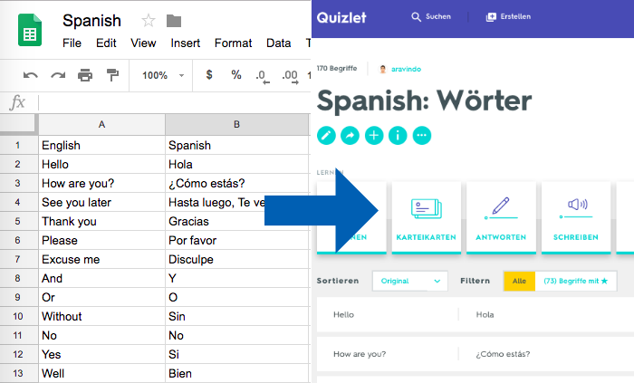

<p align="center">
	
	<br>
	<br>
</p>

> Sync google spreadsheets to quizlet

## Summary

- Edit wordlists in google spreadsheets and sync with quizlet.
- Uses the Google and Quizlet APIs, developer accounts required. 
- Uses two columns of a Google spreadsheets to fill the Quizlet term and definition.
 

## Setup developer accounts

Developer accounts of Google and Quizlet are required.   

### Enable Google API

Create a developer account at https://developers.google.com. 

1. Use this [wizard](https://console.developers.google.com/start/api?id=drive) to create or select a project in the Google Developers Console and automatically turn on the API. Click *Continue*, then *Go to credentials*.
1. On the *Add credentials to your project* page, click the *Cancel* button.
1. At the top of the page, select the *OAuth consent screen* tab. Select an *Email address*, enter a *Product name* if not already set, and click the *Save* button.
1. Select the *Credentials* tab, click the *Create credentials* button and select *OAuth client ID*.
1. Select the application type *Other*, enter the name "Drive API Quickstart", and click the *Create* button.
1. Click *OK* to dismiss the resulting dialog.
1. Click the *download icon* (Download JSON) button to the right of the client ID.
1. Move this file to your working directory and rename it `google_client_secret.json`.
1. In the Google Console also active the *Google Sheets API*. 

> (copied and adjusted from https://developers.google.com/drive/api/v3/quickstart/nodejs)

On the first execution of `index.js` the account will be authorized. The script will write out `google_credentials.json` to your directory.

### Enable Quizlet API

Log in to your Quizlet account and go to the [Developer Dashboard](https://quizlet.com/api-dashboard).

Then, create an API application (you can call it whatever you want), which will give you another Client ID and Secret Key. You'll need to enter a "Redirect URL" for your app, which you can make `http://localhost` since we won't actually be deploying this app.

Once authorized, Bearer tokens are valid for 10 years by default, so you only need to run through the OAuth process once and save your token somewhere secure.

Open this URL in a browser, replacing `CLIENT_ID` with the ID you just created: `https://quizlet.com/authorize?response_type=code&client_id=CLIENT_ID&scope=read%20write_set%20write_group&state=anything`

After authorizing your account, you'll be redirected to `http://localhost` which will fail, but the URL should have a `code` querystring parameter. 

We need to make one more request to get a long-lived Bearer token. We'll use `curl` for this example, but you can also follow the instructions on [this page](https://quizlet.com/api/2.0/docs/authorization-code-flow).

```bash
curl https://api.quizlet.com/oauth/token \
  -F "grant_type=authorization_code" \
  -F "code=YOUR_CODE" \
  -u YOUR_CLIENT_ID:YOUR_CLIENT_SECRET \
  -X POST > quizlet_client_secret.json
```

You should receive a JSON object with an `access_token=***`. Save that as `quizlet_client_secret.json` in your working directory. 

## Installation

For a given Google Spreadsheet, grab it's ID from the URL. The ID is the part of the URL between `d/` and `/edit`: `https://docs.google.com/spreadsheets/d/******/edit`

Create a config file `config.json` with the following content, and adjust: 

```json
{
    "sheet_id": "YOUR_SHEET_ID",
    "prefix": "From Sheets: ",
    "columns": "A:B",
    "skip_first_row": false,
    "quizlet_visibility": "only_me",
    "quizlet_lang_terms": "en",
    "quizlet_lang_definitions": "es"
}
```

Config options: 
 * "sheet_id": the id of the google spreadsheet
 * "prefix": the name of the Quizlet-Set will be "$prefix $tabname"
 * "columns": two columns the use in the spreadsheets
 * "skip_first_row": skip first header row
 * "quizlet_visibility": Define who is allowed to view/use this Quizlet set. "public", "only_me"
 * "quizlet_lang_terms": Language of the terms. See the [list of possible languages](https://quizlet.com/api/2.0/docs/languages).
 * "quizlet_lang_definitions": Language of the definitions. See the [list of possible languages](https://quizlet.com/api/2.0/docs/languages).
 * "quizlet_set_id": Id of the Quizlet set. (Is automatically added by the script.) 

## Running


```bash
npm install
node index.js
```

When it's done, go back to Quizlet and you should see the new study set.


## What it's doing

The script keeps track of which spreadsheet tabs created each quizlet study set by writing the quizlet set id to `config.json`. This maps each Google Spreadsheet tab ID to the Quizlet set ID.

Not all edge cases are handled, but this means you add new tabs at any time, rename them, etc., and existing sets will be updated accordingly.

## TODO
* Support multiple tabs.
* Possible to run this as an [Google Apps Script](https://developers.google.com/apps-script/) within a Spreadsheet to update sets automatically?
 

## Maintainers
- [Aravindo Wingeier](https://github.com/synox)

## Based on...
https://github.com/abstrctn/quizlet-sheet-sync - the code has been mostly rewritten. Author: [Michael Strickland](https://twitter.com/moriogawa), 


## License
Apache-2.0